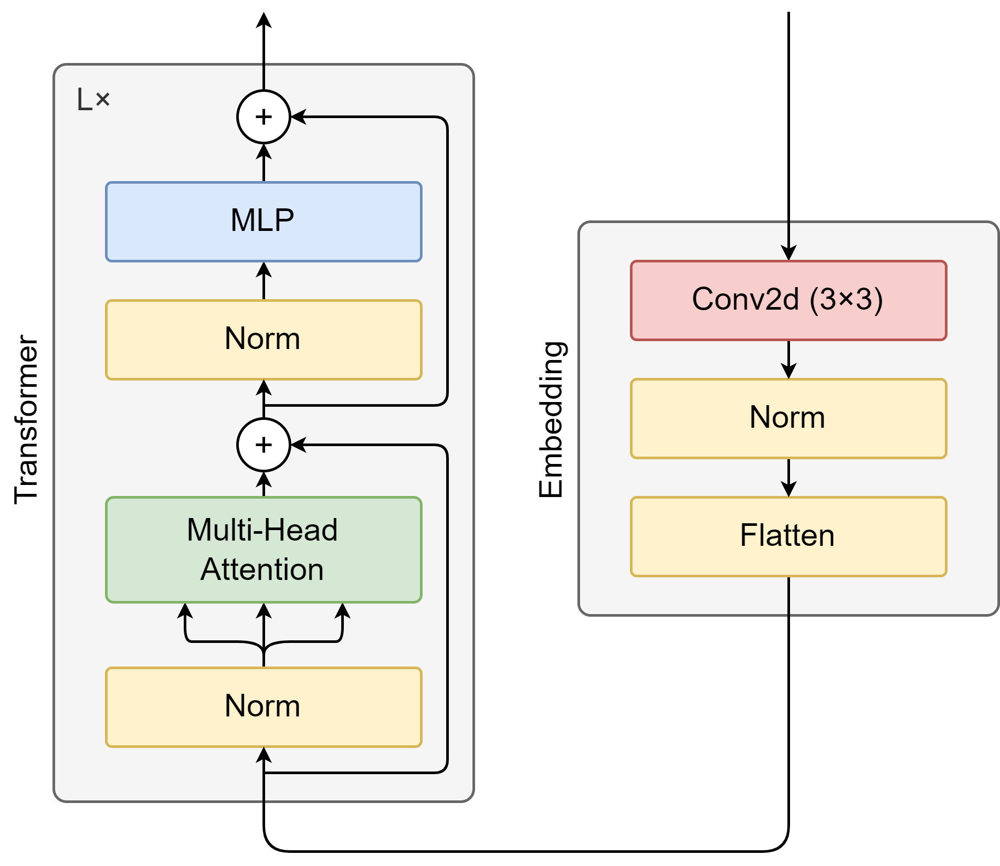

# Data Science Workshop - FHNW

Im Rahmen des Data Science Workshops an der FHNW habe ich mich intensiv mit mehreren aktuellen wissenschaftlichen Papers auseinandergesetzt. Die gewonnenen Erkenntnisse aus diesen Papers dienen als Grundlage für die Hypothesen, die ich im Workshop aufstellen und validieren werde.

Folgende Papers wurden analysiert, wobei das Hauptaugenmerk auf dem letzten Paper lag:

- [Attention Is All You Need](https://proceedings.neurips.cc/paper_files/paper/2017/file/3f5ee243547dee91fbd053c1c4a845aa-Paper.pdf)
- [An Image is Worth 16x16 Words: Transformers for Image Recognition at Scale](https://openreview.net/pdf?id=YicbFdNTTy)
- [CvT: Introducing Convolutions to Vision Transformers](https://openaccess.thecvf.com/content/ICCV2021/papers/Wu_CvT_Introducing_Convolutions_to_Vision_Transformers_ICCV_2021_paper.pdf)

## Hypothese 1

> Die gute Performance der CvT-Architektur lässt sich primär durch die frühen Convolutional-Schichten erklären. Spätere Convolutional-Schichten in den Transformer-Blöcken tragen nur marginal zur Gesamtleistung bei und können weggelassen werden, ohne signifikanten Performanceverlust bei den betrachteten Metriken zu verursachen.

### Aufbau des Experiment

#### Architekturen

Das vereinfachte CvT-Modell wird mit bestehenden Architekturen verglichen:

- [CvT (Convolutional Vision Transformer) – Microsoft](https://github.com/microsoft/CvT)
- [ViT (Vision Transformer) – Google Research](https://github.com/google-research/vision_transformer)
- [ResNet50](https://pytorch.org/vision/main/models/generated/torchvision.models.resnet50.html)

Das **vereinfachte CvT-Modell** setzt sich, wie im ViT-Paper beschrieben, aus 3 sequentiell angeordneten Transformer-Blöcken zusammen. Im Gegensatz zum einfachen Embedding bestehend aus einer rein linearen Projektion, wird hier ein **Convolutional Layer** verwendet, wie dies im CvT-Paper ebenfalls beschrieben ist. Dieser Layer wird jedoch ausschliesslich vor dem ersten Transformer-Block eingesetzt, und zwar vor dem ersten Transformer-Block.

#### Dataset

Als Dataset wird der **[TinyImagenet-Datensatz](https://www.kaggle.com/datasets/akash2sharma/tiny-imagenet)** verwendet. Dieser enthält 200 Klassen mit jeweils 500 Bildern, die eine Auflösung von 64x64 Pixeln haben. Die Bilder sind in 3 Kanälen (RGB) gespeichert. Das Dataset ist in Trainings-, Validierungs- und Testdaten unterteilt. Die Trainingsdaten bestehen aus 100'000 Bildern, die Validierungsdaten aus 10'000 Bildern und die Testdaten aus 10'000 Bildern.

#### Metriken

Als Metrik zur Leistungsbewertung wird die Accuracy verwendet, als Loss-Funktion wird der Cross-Entropy-Loss verwendet.
Zusätzlich wird die Anzahl der trainierbaren Parameter, sowie die Trainingszeit pro Epoche und Inference-Zeit pro Bild gemessen.

## Hypothese 2

>

### Aufbau des Experiment

#### Architekturen

#### Dataset

#### Metriken
