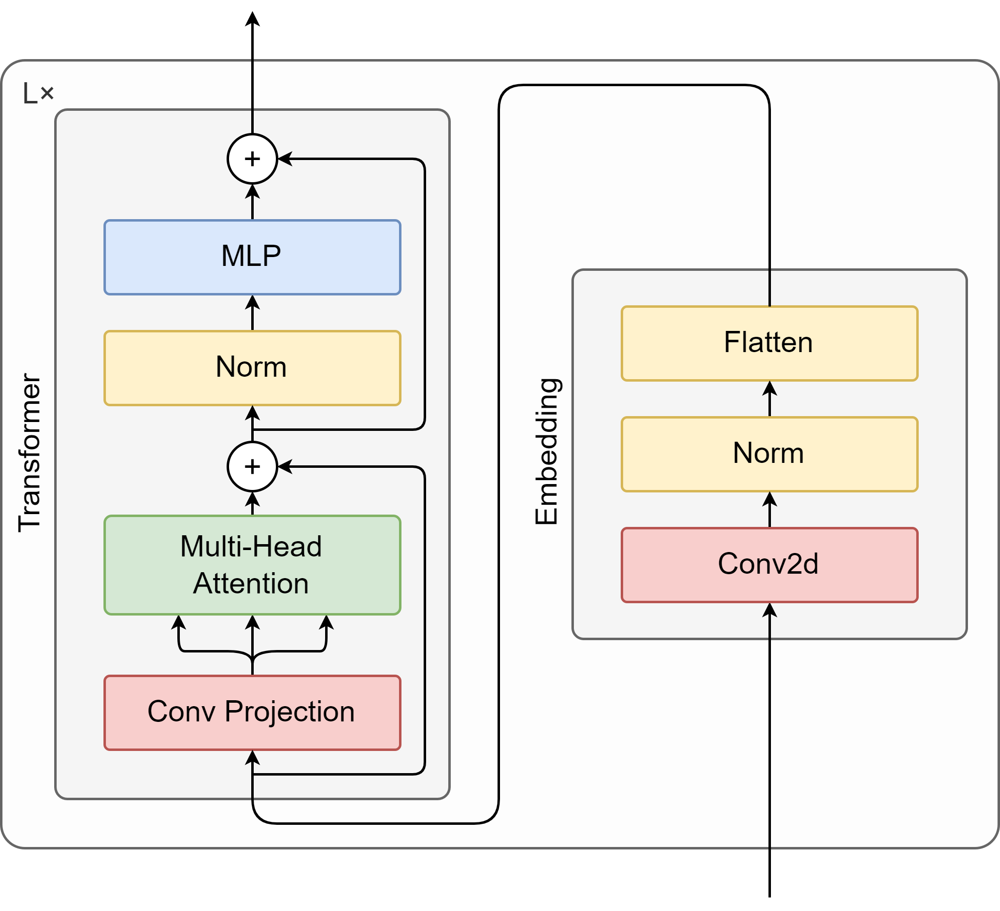

# Data Science Workshop - FHNW

Im Rahmen des Data Science Workshops an der FHNW habe ich mich intensiv mit mehreren aktuellen wissenschaftlichen Papers auseinandergesetzt. Die daraus gewonnenen Erkenntnisse dienen als Grundlage für die Hypothesen, die ich im Workshop aufstellen und validieren werde.

Folgende Papers wurden analysiert, wobei das Hauptaugenmerk auf dem letzten Paper lag:

- [Attention Is All You Need](https://proceedings.neurips.cc/paper_files/paper/2017/file/3f5ee243547dee91fbd053c1c4a845aa-Paper.pdf)
- [An Image is Worth 16x16 Words: Transformers for Image Recognition at Scale](https://openreview.net/pdf?id=YicbFdNTTy)
- [CvT: Introducing Convolutions to Vision Transformers](https://openaccess.thecvf.com/content/ICCV2021/papers/Wu_CvT_Introducing_Convolutions_to_Vision_Transformers_ICCV_2021_paper.pdf)

## Hypothese 1

> Die gute Performance der CvT-Architektur lässt sich primär durch die zu Beginn ausgeführte Embedding Convolution erklären. Spätere Convolutions in und zwischen den Transformer-Blöcken tragen nur marginal zur Gesamtleistung bei und können weggelassen werden, ohne Performanceverlust bei den betrachteten Metriken zu verursachen.

### Aufbau des Experiments

Zur Validierung der Hypothese werden die bestehenden Architekturen aus den obigen Papers als auch eigene vereinfachte Varianten des CvT-Modells verglichen.

Die Modelle werden in einem ersten Schritt mit den gleichen Hyperparametern trainiert, um die Performance der Modelle zu vergleichen. In einem zweiten Schritt wäre eine Optimierung der Hyperparameter für die einzelnen Modelle denkbar, um die Performance weiter zu steigern. Als Optimizer wird AdamW verwendet werden, da dieser ebenfalls in den Papers verwendet wurde.

#### Vergleichsmodelle

- [ResNet50](https://pytorch.org/vision/main/models/generated/torchvision.models.resnet50.html)
- [ViT (Vision Transformer) – Google Research](https://github.com/google-research/vision_transformer)
- [CvT (Convolutional Vision Transformer) – Microsoft](https://github.com/microsoft/CvT): /
  

#### Vereinfachte CvT-Modelle

Die vereinfachten CvT-Modelle übernehmen den Transformer-Block, wie er im ViT-Paper beschrieben wurde. Anstelle einer linearen Projektion als Embedding zu verwenden, kommt jedoch ein Convolutional Embedding zum Einsatz. Im letzten Versuch wird zusätzlich auch noch ein Convolutional Block zwischen den Transformer-Blöcken eingefügt.

1. **Convolutional Embedding:**\
    Das Embedding erfolgt duch eine einfache Convolution, wie diese bereits im CvT-Paper verwendet wurde:\
    

2. **Enhanced Convolutional Embedding:**\
    Das Embedding erfolgt durch eine Kombination von zwei Convolutions: \
    

3. **Recurrent Convolutions:**\
    Zusätzlich zu einem Convolutional Embedding (siehe 1. oder 2.) werden auch zwischen den Transformer-Blöcken Convolutions eingeführt, um die Token-Dimensionen progressiv zu reduzieren. Dies sollte vor allem zur Reduktion der Rechenkomplexität in der Attention-Berechnung beitragen. Dies wurde auch im CvT-Paper so umgesetzt. In diesem Modell wird im Gegensatz zum CvT-Modell auf die Convolutional Projection vor dem Attention-Mechanismus verzichtet: \
     \

### Dataset

Verwendet wird der [Tiny Imagenet-Datensatz](https://www.kaggle.com/datasets/akash2sharma/tiny-imagenet):

- 200 Klassen, je 500 Trainingsbilder (insgesamt 100'000)
- Auflösung: 64×64 Pixel, RGB
- Unterteilt in: Training (100'000), Validierung (10'000), Test (10'000); wobei die Testbilder keine Labels besitzen und somit nicht evaluiert werden können.

### Metriken

Zur Bewertung der Modelle werden folgende Metriken herangezogen:

- Accuracy (Hauptmetrik)
- Cross Entropy Loss
- Anzahl der trainierbaren Parameter
- Trainingszeit pro Epoche
- Inference-Zeit pro Bild

## Hypothese 2

> Durch den Einsatz von Grad-CAM kann gezeigt werden, dass sich die Convolutions in der CvT-Architektur auf die für die Klassifizierung relevanten Bildregionen konzentrieren.

### Aufbau des Experiments

Zur Validierung dieser Hypothese wird Grad-CAM (Gradient-weighted Class Activation Mapping) eingesetzt, um visuell darzustellen, auf welche Bildregionen sich unterschiedliche Convolutions bei der Klassifikation konzentrieren. Grad-CAM wird dabei in die Convolutions der CvT-Architektur integriert, um aus den Gradienten der Convolutions die Heatmap zu berechnen. Diese Heatmap wird dann mit dem Originalbild überlagert, um die für die Klassifikation relevanten Bildregionen hervorzuheben.
Es wird untersucht, ob sich ein ähnliches Verfahren auch auf die Attention-Maps der Transformer-Blöcke anwenden lässt.

### Dataset

Wie in Hypothese 1 wird der Tiny ImageNet-Datensatz verwendet. Zusätzlich werden einige Beispielbilder manuell ausgewählt, bei denen die Aktivierungen visuell besonders aussagekräftig interpretiert werden können (z. B. Objekte klar vom Hintergrund getrennt).
